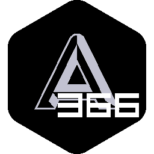

<div align=center></div>

# Auto366

天学网自动化答题工具！解放双手，提高学习效率！

## 警告

### 本工具仅供学习和研究使用，**严禁商用**

## 项目简介

Auto366 是一个专为天学网设计的自动化答题工具，支持多种题型自动填写，单词pk快速自动填写，辅助工具有听力答案提取和等待音频替换。通过智能检测下载的练习文件，自动提取答案并完成填写，让您专注于学习而不是重复性操作。

B站介绍视频：[www.bilibili.com/video/BV195xLzEESR/](https://www.bilibili.com/video/BV195xLzEESR/)

官方网站/在线答案查看器：[366.cyril.zone/](https://366.cyril.zone/)
备用地址：[366.cyril.qzz.io/](https://366.cyril.qzz.io/)

## Todo List待办清单

### 新版本(v0.9.9)已完成

- [功能优化]优化深色模式设计，优化监听日志设计
- [新功能]添加AI连接测试及UI(By Submerge)
- [BUG修复]修复了自动填空的许多bug提升稳定性与兼容性(By A6TVhmj)

### BUG问题

- 答案获取出现部分题型无法获取完整

### TODO新功能

#### 短期更新

- 加入Funny模式
- 优化答案获取题型规则
- 优化听力自动化(针对听说考试模式)
- Log日志系统与通知系统优化
- 扩展规则系统
- 支持阅读回答问题题型
- 支持选项内容为图片的选择题（文章结构题）
- 优化朗读的匹配问题

#### 长期更新

- 暂无

## 安装说明

### 方法一：直接下载（推荐）

1. 从 [Releases](https://github.com/cyrilguocode/Auto366/releases) 页面下载最新版本安装包
2. 点击安装
3. 安装后双击运行 `Auto366.exe`
4. 安装完成后打开工具会有更详细的教程

### 方法二：源码编译

```bash
# 克隆项目
git clone https://github.com/cyrilguocode/Auto366.git
cd Auto366

# 安装依赖
npm install

# 运行开发版本
npm start

# 打包应用
npm run build
```

### 快捷键

- `Ctrl+F12` - 打开开发者工具

## 您在使用中有任何问题都可以在讨论中提出

## 贡献指南

[贡献指南](https://366.cyril.zone/tutorial/contributingGuide)

## 许可证

本项目采用 GNU General Public License v3.0 许可证 - 查看 [LICENSE](LICENSE) 文件了解详情。

但此项目严格禁止其他个体将本项目用于商业用途，包括但不限于转卖、推广以及各类牟利行为等。

**隐私协议**：[隐私协议](https://366.cyril.zone/tutorial/privacyPolicy)

**使用协议**：[使用协议](https://366.cyril.zone/tutorial/termsOfService)

**免责声明**：本工具仅供学习和研究使用，使用者需自行承担使用风险，开发者不承担任何法律责任。
