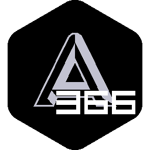

<div align=center></div>

# Auto366

天学网自动化答题工具！解放双手，提高学习效率！

## 警告

### 本工具仅供学习和研究使用，**严禁商用**

## 项目简介

Auto366 是一个专为天学网设计的自动化答题工具，支持多种题型自动填写，单词pk快速自动填写，辅助工具有听力答案提取和等待音频替换。通过智能检测下载的练习文件，自动提取答案并完成填写，让您专注于学习而不是重复性操作。

B站介绍视频：[www.bilibili.com/video/BV195xLzEESR/](https://www.bilibili.com/video/BV195xLzEESR/)

官方网站/在线答案查看器：[366.cyril.zone/](https://366.cyril.zone/)
备用地址：[366.cyril.qzz.io/](https://366.cyril.qzz.io/)

## Todo List待办清单

### 新版本(v0.10.0)已完成

- [架构优化]按业务整理主进程模块，按页面整理界面代码，统一 IPC 登记和本地 HTTP 路由
- [新功能]支持半句批改题型(By A6TVhmj)
- [新功能]添加 AI 答案获取，自动发现候选响应和 ZIP 文本，生成请求匹配与答案提取规则，预览确认后启用(未完成)
- [新功能]接入新的免 Key 内置 AI，支持连接测试与模型选择，模型选项标注“内置”
- [功能优化]复杂设置按模块存储为 JSON，简单偏好保留 localStorage，完善旧配置迁移与备份保护
- [功能优化]统一模块日志前缀，改善中文输出，支持按每次启动记录独立日志文件
- [功能优化]整理设置页面，完善必读新手引导、加入教程按钮聚焦和测验，补充缓存与增强模式排障说明
- [功能优化]社区规则集重命名为扩展规则集，移除客户端上传入口；补齐进程加速页面标题
- [BUG修复]修复重构后的启动、动态注入和通信兼容问题

### BUG问题

- 部分题型自动听力未适配

### TODO新功能

#### 短期更新

- 加入Funny模式
- 继续优化通知系统与日志交互
- 完成 AI 提取规则共享服务的鉴权、审核和签名发布（当前尚未接通）

#### 长期更新

- 暂无

## 安装说明

### 方法一：直接下载（推荐）

1. 从 [Releases](https://github.com/cyrilguocode/Auto366/releases) 页面下载最新版本安装包
2. 点击安装
3. 安装后双击运行 `Auto366.exe`
4. 安装完成后打开工具会有更详细的教程

### 方法二：源码编译

```bash
# 克隆项目
git clone https://github.com/cyrilguocode/Auto366.git
cd Auto366

# 安装依赖
npm install

# 运行开发版本
npm start

# 打包应用
npm run build
```

### 快捷键

- `Ctrl+F12` - 打开开发者工具

## 您在使用中有任何问题都可以在讨论中提出

## 贡献指南

[架构文档](docs/ARCHITECTURE.md)

[贡献指南](https://366.cyril.zone/tutorial/contributingGuide)

## 许可证

本项目采用 GNU General Public License v3.0 许可证 - 查看 [LICENSE](LICENSE) 文件了解详情。

但此项目严格禁止其他个体将本项目用于商业用途，包括但不限于转卖、推广以及各类牟利行为等。

**隐私协议**：[隐私协议](https://366.cyril.zone/tutorial/privacyPolicy)

**使用协议**：[使用协议](https://366.cyril.zone/tutorial/termsOfService)

**免责声明**：本工具仅供学习和研究使用，使用者需自行承担使用风险，开发者不承担任何法律责任。
